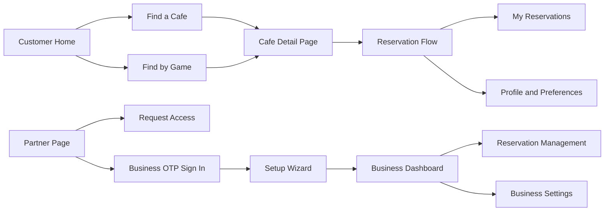
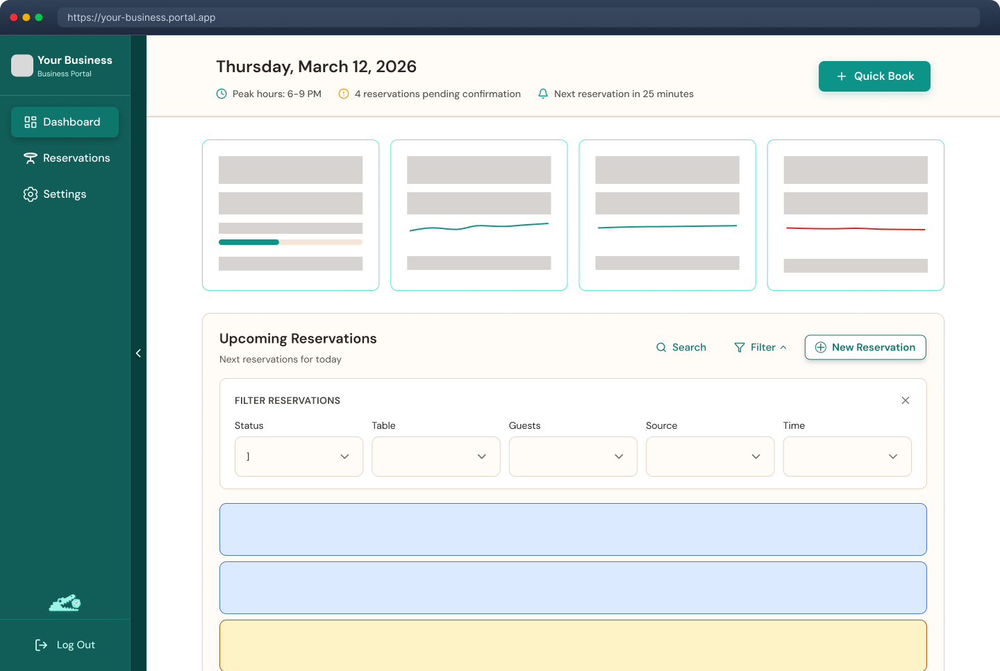
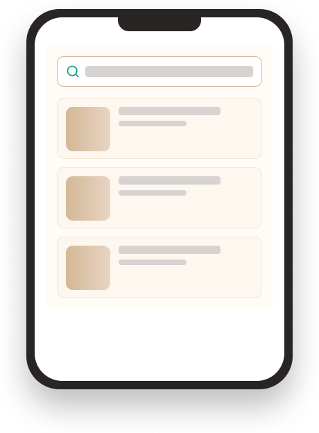
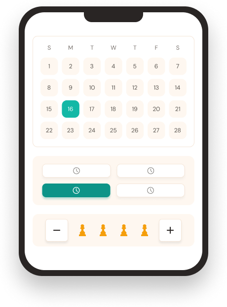
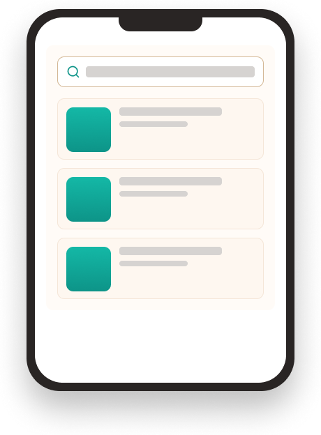
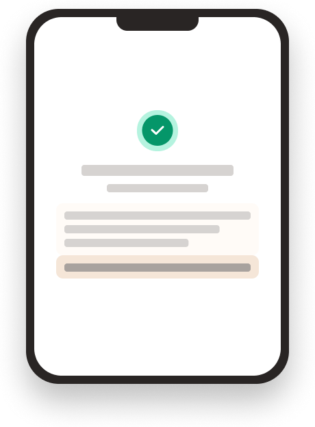
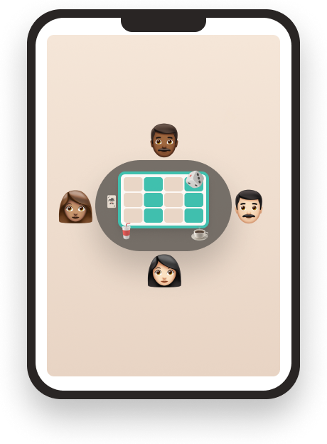

# Gatore User Technical Manual

**Project:** Gatore  
**Document Type:** User Technical Manual  
**Project Context:** Capstone Project  
**Application Scope:** Client and Server User Workflows  
**Prepared For:** End Users, Evaluators, Demonstrators, and Project Stakeholders  

---

## Table of Contents

1. [Introduction](#1-introduction)
2. [System Overview](#2-system-overview)
3. [User Roles](#3-user-roles)
4. [Before You Begin](#4-before-you-begin)
5. [Interface Overview](#5-interface-overview)
6. [Customer Guide](#6-customer-guide)
7. [Cafe Owner Guide](#7-cafe-owner-guide)
8. [Tutorials and Worked Examples](#8-tutorials-and-worked-examples)
9. [Common Messages and Troubleshooting](#9-common-messages-and-troubleshooting)
10. [Best Practices](#10-best-practices)
11. [Glossary](#11-glossary)
12. [Related Project Documents](#12-related-project-documents)

---

## 1. Introduction

### 1.1 Purpose of This Manual

This manual explains how to use the Gatore platform from an end-user perspective. It is designed to help:

- customers discover board game cafes and make reservations,
- returning users manage their accounts and bookings,
- cafe owners request access to the Business Portal,
- approved business users configure their cafe and manage reservations.

This document focuses on real workflows available in the current project build. It is written in a professional, task-oriented format so a new user can follow the system confidently without prior knowledge of the codebase.

### 1.2 What Gatore Does

Gatore is a full-stack platform for:

- discovering board game cafes,
- browsing games available at partner venues,
- booking tables,
- managing personal reservations,
- onboarding cafe partners,
- operating a business dashboard for reservations and business settings.

### 1.3 Intended Audience

This manual is intended for:

- course evaluators and capstone reviewers,
- end users testing the application,
- instructors and demonstration audiences,
- cafe owners using the partner-facing features.

---

## 2. System Overview

### 2.1 Platform Summary

Gatore is made up of two major experiences:

1. A **customer-facing web application** for discovery and reservations
2. A **Business Portal** for approved cafe partners

### 2.2 Functional Overview

### 2.3 User Experience Highlights

- Multi-step email signup with OTP verification
- Google sign-in support
- Search by cafe or by game
- Table reservation flow with optional game selection
- Personal reservation history and cancellation
- Business access request process
- Business OTP sign-in without stored business password
- Guided cafe setup wizard
- Reservation management dashboard for cafe owners

---

## 3. User Roles

Gatore supports two primary user roles.

| Role | Description | Main Features |
| --- | --- | --- |
| Customer | A player or guest looking for cafes and reservations | Browse cafes, search by game, book tables, manage reservations, update profile |
| Cafe Owner / Business User | An approved partner managing a cafe | Request access, sign in via OTP, complete setup, manage tables, hours, games, pricing, reservations |

### Important Role Behavior

- Business users are redirected into the dashboard experience instead of the public customer pages after sign-in.
- Customers can book as authenticated users or continue as guests during reservation.

---

## 4. Before You Begin

### 4.1 Usage Assumption

This manual assumes the application is already deployed and running locally or on a hosted environment.

If the system still needs to be installed and configured, use the deployment/setup instructions in [DEPLOYMENT_GUIDE.md](DEPLOYMENT_GUIDE.md).

### 4.2 Recommended Browser and Access Conditions

Use a modern browser such as:

- Google Chrome
- Microsoft Edge
- Mozilla Firefox

For the smoothest experience, ensure:

- the client is reachable,
- the backend API is available,
- OTP email delivery is configured,
- Google OAuth is configured if Google sign-in will be demonstrated.

---

## 5. Interface Overview

### 5.1 Main Navigation

The public application header provides access to:

- **Find a cafe**
- **Find by game**
- **How It Works**
- **For Cafe Owners**
- **Pricing**
- **About**
- **Contact**
- **Sign in / Get started**

Authenticated customers also gain quick access to:

- **My Profile**
- **Reservations**
- **Log out**

### 5.2 Visual Reference: Platform Experience

The image above reflects the style and dashboard direction of the partner-facing experience.

### 5.3 Customer Journey Snapshot

These visuals correspond directly to the five-step customer journey presented inside the application.

---

## 6. Customer Guide

### 6.1 Landing on the Home Page

When a customer first opens Gatore, the home page serves as the entry point to discovery and booking.

The home experience is designed to help the user quickly:

- understand the product,
- navigate to discovery pages,
- learn how bookings work,
- access sign-in and signup options.

### Key actions available from the home page

1. Browse featured content
2. Navigate to **Find a Cafe**
3. Navigate to **Find by Game**
4. Open customer sign-in or signup
5. Explore cafe-owner information

---

### 6.2 Creating a Customer Account

Customers can create an account using either:

1. **Email + OTP + password**
2. **Google sign-in**

### Option A: Email signup workflow

The customer signup modal follows a guided sequence:

1. Enter email address
2. Receive a 6-digit OTP by email
3. Verify the OTP
4. Set a password
5. Enter profile information
6. Save game preferences
7. Reach the success screen

### Password requirements

The password must include:

- at least 8 characters,
- one uppercase letter,
- one lowercase letter,
- one number,
- one special character.

### Example

`BoardGame123!`

### Option B: Google sign-in workflow

When a user chooses Google sign-in:

1. Google authentication opens
2. The user authorizes the account
3. The system receives Google profile information
4. New users continue to profile completion
5. Returning users are signed in immediately

### Practical note

Google sign-in is faster for demonstrations because it bypasses manual password creation.

---

### 6.3 Signing In

Customers can sign in from the header using the customer sign-in tab.

### Steps

1. Click **Sign in**
2. Stay on the **Customer** tab
3. Enter email and password
4. Submit the form

If successful, the user is returned to the app in an authenticated state.

### Common sign-in outcomes

- If the email has not been verified yet, the system asks the user to complete OTP verification first.
- If the account was created through Google only, the system instructs the user to continue with Google.
- If the account belongs to a business user, the system redirects them to use the Business Portal instead.

---

### 6.4 Finding a Cafe

The **Find a Cafe** page is designed for discovery by venue.

### What users can do

- browse available cafes,
- search by name,
- review location and rating information,
- see whether a cafe is open,
- continue into a detailed cafe profile.

### Typical workflow

1. Open **Find a Cafe**
2. Review the list of venues
3. Select a cafe card
4. Open the detailed page

### Information shown on a cafe listing

- cafe name,
- location,
- rating and review count,
- visible branding/logo,
- availability cues,
- number of games and tables where supported.

---

### 6.5 Finding a Cafe by Game

The **Find by Game** page helps users start with the game rather than the venue.

### What users can do

- search BoardGameGeek-linked titles,
- discover cafes that carry a chosen game,
- view cafe results associated with that game.

### Typical workflow

1. Open **Find by Game**
2. Search for a known title such as `Catan` or `Pandemic`
3. Select the desired game
4. Review cafes that offer that game
5. Open a cafe detail page to book

### Useful scenario

This page is ideal when a user already knows the game they want to play and needs to find a location that has it.

---

### 6.6 Viewing a Cafe Detail Page

The cafe detail page is the main decision point before a reservation.

### Information available on this page

- cafe identity and branding,
- address and contact information,
- description/about section,
- available games,
- available tables,
- operating hours,
- reservation entry point.

### Why this page matters

This page consolidates the information a customer needs before booking:

- where the cafe is,
- what games it offers,
- whether it is open,
- what tables are likely available,
- how to start a reservation.

---

### 6.7 Making a Reservation

The reservation modal is one of the most important user workflows in the system.

### Reservation flow steps shown to the user

1. **When**
2. **Games**
3. **Details**
4. **Payment**
5. **Confirm**

After confirmation, the user reaches a success screen.

### Step 1: When

The user chooses:

- date,
- time,
- party size.

The system automatically attempts to assign the best available table for the selected party size.

### Step 2: Games

The user may:

- reserve a game to be prepared at the table,
- skip game selection.

If a game is already reserved for the selected time slot, it is marked unavailable.

### Step 3: Details

The user can proceed in one of two ways:

- sign in for the full account experience,
- continue as a guest by entering name and email.

### Step 4: Payment

The current build includes a payment information interface and pricing summary for the booking experience.

Important note:

- In the current capstone build, this step behaves as a user-facing booking/payment screen rather than a live third-party payment gateway integration.

### Step 5: Confirm

The user reviews:

- venue,
- date and time,
- party size,
- selected game,
- contact identity,
- booking summary.

After selecting **Confirm reservation**, the reservation is submitted.

### Success outcome

The success screen confirms the booking and directs the user to manage future changes from the reservations area.

---

### 6.8 Booking as a Guest

Guest booking is useful when a user wants a quick reservation without creating a full account.

### Guest flow

1. Begin a reservation
2. Complete date/time/party details
3. Choose **Continue as guest**
4. Enter name and email
5. Review and confirm

### Guest limitations

Guest users provide less persistent account context than authenticated users.

For repeated use of the platform, a full account is recommended.

---

### 6.9 Managing Reservations

Authenticated customers can open the **My Reservations** page.

### Main capabilities

- view reservation history,
- filter reservation states,
- review venue and game details,
- cancel supported reservations.

### What users will see

- upcoming reservations,
- past reservations,
- cancelled reservations,
- reservation cards with time, venue, party size, and game details.

### Canceling a reservation

To cancel a reservation:

1. Open **My Reservations**
2. Locate the reservation card
3. Use the cancel action
4. Confirm the cancellation

After cancellation, the reservation status updates to `cancelled`.

---

### 6.10 Managing Profile and Preferences

Authenticated users can open **My Profile**.

### Profile page functions

- view and edit contact information,
- maintain name and phone details,
- review and save gaming preferences,
- set preferred game types,
- set preferred group size,
- set desired complexity level.

### Why preferences matter

These settings help shape a more personalized discovery experience and support recommendation-style features in the application.

---

### 6.11 Customer FAQ

### Do I need an account to reserve?

No. The reservation flow supports guest booking.

### Can I reserve a specific game?

Yes. During the reservation flow, the user can choose a game if one is available for the selected venue and time slot.

### Can I update my profile later?

Yes. Contact information and preference settings can be edited from **My Profile**.

### Where do I see my bookings?

In the **Reservations** page after signing in.

---

## 7. Cafe Owner Guide

### 7.1 Accessing the Partner Experience

Cafe owners begin from either:

- **For Cafe Owners**
- **Get Started -> Business Portal**

The business journey is intentionally separated from the customer flow.

---

### 7.2 Requesting Business Access

Business accounts are not created instantly through self-service signup. Instead, owners submit an access request.

### Access request workflow

1. Open the Business Portal
2. Choose **Request partner access**
3. Enter:
   - cafe name,
   - owner name,
   - email,
   - phone,
   - city,
   - message
4. Submit the request

### Result

The user sees a success confirmation indicating that the request has been received for review.

### Visual context

This preview helps business users understand the kind of management interface they are requesting access to.

---

### 7.3 Business Sign-In with OTP

Approved business users sign in through an email OTP process rather than a stored business password.

### Sign-in flow

1. Open Business Portal
2. Choose **Sign in to my dashboard**
3. Enter the approved business email
4. Request the verification code
5. Check email
6. Enter the 6-digit OTP
7. Access the dashboard

### Benefits of this design

- reduces password management complexity,
- supports secure email-based access control,
- fits the partner approval workflow.

---

### 7.4 Completing the Cafe Setup Wizard

After first successful business authentication, the system checks whether the business profile is fully configured.

If setup is incomplete, the user is guided through a wizard.

### Setup steps in the current build

1. Business profile and contact information
2. Tables and seating configuration
3. Operating hours
4. Game library
5. Menu setup
6. Pricing model

### Step 1: Business profile and contact information

The owner provides or confirms:

- cafe name,
- contact email,
- contact name,
- website,
- business type,
- phone number,
- address,
- city,
- province,
- postal code,
- logo image,
- timezone.

### Step 2: Tables and seating

The owner defines the seating inventory used for reservations.

Each table includes:

- table name,
- capacity,
- table type.

This configuration directly affects reservation availability logic.

### Step 3: Operating hours

The owner configures business hours for each day of the week.

The system supports:

- custom hours by day,
- marking days as closed,
- applying Monday's hours to all days for faster setup.

### Step 4: Game library

The owner searches the BoardGameGeek database and adds games offered by the cafe.

Search results show:

- game title,
- player count,
- duration,
- difficulty,
- categories,
- cover art when available.

### Step 5: Menu setup

The setup wizard includes a menu planning step with setup options such as:

- upload PDF,
- add items manually,
- start with template.

Professional note:

- In the current project build, the core operational settings fully supported by the dashboard are business info, tables, hours, game library, pricing, and account management.
- The menu step is presented in the onboarding experience, but ongoing menu management is not the primary finalized operational workflow in the current settings area.

### Step 6: Pricing model

The owner chooses how reservations will be priced.

Supported pricing models:

- hourly rate,
- flat cover fee,
- hybrid.

Optional threshold logic can also be enabled to waive fees when a food or drink spend threshold is reached.

### Setup completion result

Once setup is completed:

- the cafe profile is marked ready,
- the dashboard becomes accessible,
- the business can begin accepting and managing reservations.

---

### 7.5 Using the Business Dashboard

The Business Dashboard acts as the operational home page for approved partners.

### Information shown on the dashboard

- occupancy summary,
- total reservations for the day,
- pending reservations,
- total customers for the day,
- new customers this week,
- average session time,
- upcoming reservations list.

### Actions available from the dashboard

- review today's reservations,
- filter reservations,
- update reservation status,
- create a walk-in reservation,
- modify reservation details,
- navigate to full reservation management,
- access settings.

### Common reservation statuses

- pending
- confirmed
- seated
- cancelled
- completed

---

### 7.6 Managing Reservations as a Cafe Owner

The **Reservations** dashboard page is the dedicated operational view for reservation handling.

### Main functions

- view today's reservations,
- filter reservations by status and table,
- view table occupancy,
- create a new walk-in reservation,
- edit reservation details,
- update reservation status,
- delete reservations.

### Creating a walk-in reservation

The business user can manually create a reservation for a customer who arrives in person or books off-platform.

The modal captures:

- customer name,
- email,
- phone,
- party size,
- table,
- optional game,
- reservation date,
- arrival time,
- duration,
- notes / source.

### Editing an existing reservation

The modify reservation flow supports changes to:

- customer name,
- table,
- party size,
- reservation date,
- arrival time,
- duration,
- special requests,
- selected game.

---

### 7.7 Managing Business Settings

Business settings are organized into separate tabs.

### Available settings tabs

1. Business Info
2. Pricing
3. Tables
4. Game Library
5. Operating Hours
6. Account

### A. Business Info

Use this tab to update:

- cafe name,
- logo,
- contact information,
- website,
- address,
- business type,
- timezone.

### B. Pricing

Use this tab to:

- change pricing model,
- update hourly rate,
- update cover fee,
- define threshold waivers.

### C. Tables

Use this tab to:

- review current tables,
- add tables,
- remove tables.

### D. Game Library

Use this tab to:

- search BoardGameGeek,
- add supported games to the cafe library,
- remove games no longer available.

### E. Operating Hours

Use this tab to:

- update hours for each weekday,
- mark days closed,
- copy one day's schedule to the entire week.

### F. Account

This tab includes account-level management and the business account deletion workflow.

Professional caution:

- deleting the business account removes the linked cafe data, including tables, hours, game library, and reservations.

---

### 7.8 Business FAQ

### Can any cafe owner sign in immediately?

No. The business flow requires an approved access request before OTP sign-in works.

### Do business users create a password?

No. Business access in the current build uses email-based OTP sign-in.

### Can tables and hours be changed after setup?

Yes. They can be managed later from the Settings section.

### Can walk-in bookings be created manually?

Yes. The reservations management area supports manual reservation creation.

---

## 8. Tutorials and Worked Examples

### 8.1 Tutorial A: Book a Table as a Customer

### Scenario

A customer wants to book a table for 4 players and reserve a game.

### Steps

1. Open **Find by Game**
2. Search for `Catan`
3. Select a cafe from the results
4. Open the cafe detail page
5. Click the reservation action
6. Choose date, time, and party size of 4
7. Continue to the game step
8. Select the desired game if available
9. Either sign in or continue as guest
10. Review the booking
11. Confirm the reservation

### Expected outcome

The user reaches the success screen and can later view the booking under **My Reservations** if signed in.

---

### 8.2 Tutorial B: Sign Up as a New Customer with Email OTP

### Scenario

A first-time customer wants a full account for repeated use.

### Steps

1. Click **Get started**
2. Choose the personal account path
3. Enter an email address
4. Wait for the verification email
5. Enter the OTP
6. Create a strong password
7. Enter name and profile details
8. Save preferences
9. Finish signup

### Expected outcome

The account is created and the user is authenticated in the app.

---

### 8.3 Tutorial C: Request Business Access

### Scenario

A cafe owner wants to join Gatore as a partner.

### Steps

1. Open **For Cafe Owners**
2. Launch the Business Portal
3. Choose **Request access**
4. Fill out the request form
5. Submit the request

### Expected outcome

The user receives a confirmation that the request has been submitted for review.

---

### 8.4 Tutorial D: First-Time Cafe Owner Setup

### Scenario

An approved cafe owner signs in for the first time and prepares the business for live reservations.

### Steps

1. Open the Business Portal
2. Sign in with approved email
3. Enter OTP from email
4. Begin setup
5. Complete business profile
6. Add tables and capacities
7. Configure weekly operating hours
8. Add games from BoardGameGeek
9. Review the menu setup step
10. Choose a pricing model
11. Finish setup

### Expected outcome

The cafe dashboard is activated and ready to manage bookings.

---

### 8.5 Tutorial E: Create a Walk-In Reservation

### Scenario

A customer arrives at the cafe without booking online.

### Steps

1. Open the business dashboard
2. Go to **Reservations**
3. Choose **New Reservation**
4. Enter the guest's name and booking details
5. Assign a table
6. Optionally assign a game
7. Save the reservation

### Expected outcome

The reservation appears in the day's reservation list and affects occupancy calculations.

---

## 9. Common Messages and Troubleshooting

### 9.1 Customer-Side Issues

### Issue: OTP does not arrive

Possible causes:

- email delivery is not configured,
- the message is in spam/junk,
- the email address was entered incorrectly.

Recommended action:

- confirm the email address,
- use **Resend OTP**,
- check spam/junk folders.

### Issue: Google sign-in fails

Possible causes:

- Google OAuth is not configured correctly,
- the local origin is not authorized,
- the client ID is missing or invalid.

### Issue: No table available for the selected group

Cause:

- no table matches the party size and current time slot.

Recommended action:

- reduce or increase party size appropriately,
- try another time,
- choose another cafe.

### Issue: Reservation list is empty

Possible reasons:

- the user has not made any reservations yet,
- filters are set to a state with no matching records.

---

### 9.2 Business-Side Issues

### Issue: OTP sign-in does not work for a cafe owner

Possible causes:

- the access request has not been approved,
- the email address does not match the approved business account,
- email delivery is not functioning.

### Issue: Dashboard says setup is required

Cause:

- the business profile has not yet completed onboarding.

Recommended action:

- finish the setup wizard from start to finish.

### Issue: No restaurant is linked to the business account

Cause:

- onboarding was not completed or account linkage is incomplete.

Recommended action:

- complete setup again after approval,
- verify the account was approved through the administrative flow.

### Issue: Game search returns no results

Possible causes:

- the BoardGameGeek token is not configured,
- the search query is too narrow,
- external API access is unavailable.

---

## 10. Best Practices

### For Customers

- create an account if you plan to return often,
- save your profile preferences for a more personalized experience,
- review booking details before confirming,
- use the reservations page to keep track of upcoming visits.

### For Cafe Owners

- complete onboarding carefully the first time,
- use realistic table capacities,
- keep operating hours updated,
- maintain the game library so customer expectations remain accurate,
- review pending reservations early in the day,
- use walk-in reservations to keep dashboard data complete.

---

## 11. Glossary

| Term | Meaning |
| --- | --- |
| OTP | One-Time Password sent by email for verification |
| Business Portal | Partner-facing sign-in and management area |
| Setup Wizard | First-time guided onboarding for a cafe owner |
| Walk-in Reservation | Reservation created manually by staff rather than by a customer online |
| Game Library | The set of games a cafe makes available to customers |
| Pricing Model | How a cafe charges for table reservations |
| Party Size | Number of guests in the booking |
| Reservation Status | Current operational state of a booking such as pending or confirmed |

---

## 12. Related Project Documents

For a complete capstone submission package, this manual should be used together with:

- [README.md](README.md)
- [DEPLOYMENT_GUIDE.md](DEPLOYMENT_GUIDE.md)

### Recommended usage

- Use the **Deployment Guide** to install and run the system.
- Use this **User Technical Manual** to demonstrate the live workflows.

---

## Closing Note

Gatore was designed to provide a smoother and more engaging way to discover board game cafes, reserve tables, and support business partners through a dedicated operational portal. This manual documents the current user experience in a structured, professional format suitable for capstone presentation, evaluation, and demonstration.
